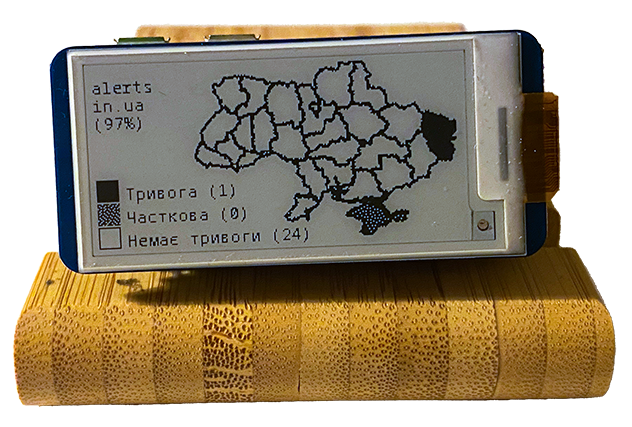

# Air Raid Monitor for Raspberry Pi 

This device shows the current status of air raid sirens in Ukraine. 

Modified version that pulls data using alerts.in.ua API.




### Bill of materials

* Raspberry Pi Zero W
* Waveshare eInk 2.13 v3
* microSD
* micro-usb cable for power
* UPS Lite

### Installation

1. Turn on SPI and I2C via `sudo raspi-config`
    ```
    Interfacing Options -> SPI
    Interfacing Options -> I2C
   ```
2. Install dependencies
    ```
    sudo apt update
    sudo apt-get install python3-pip python3-pil python3-numpy python3-lxml git 
    pip3 install RPi.GPIO spidev svglib smbus
    git clone https://github.com/waveshare/e-Paper.git ~/e-Paper
    pip3 install ~/e-Paper/RaspberryPi_JetsonNano/python/
    ```
3. Clone Air-raid Monitor
    ```
    git clone --branch ups_lite https://github.com/alerts-ua/air-raid-monitor.git ~/air-raid-monitor
    ```
6. Run the application
    ```
    python3 ~/air-raid-monitor/main.py
    ```

### Install as a service
Run the following command to install the service:
```bash
   sudo ./install.sh
```
To start/restart/stop the service:
```bash
   sudo systemctl start air-raid-monitor
   sudo systemctl restart air-raid-monitor
   sudo systemctl stop air-raid-monitor
```


